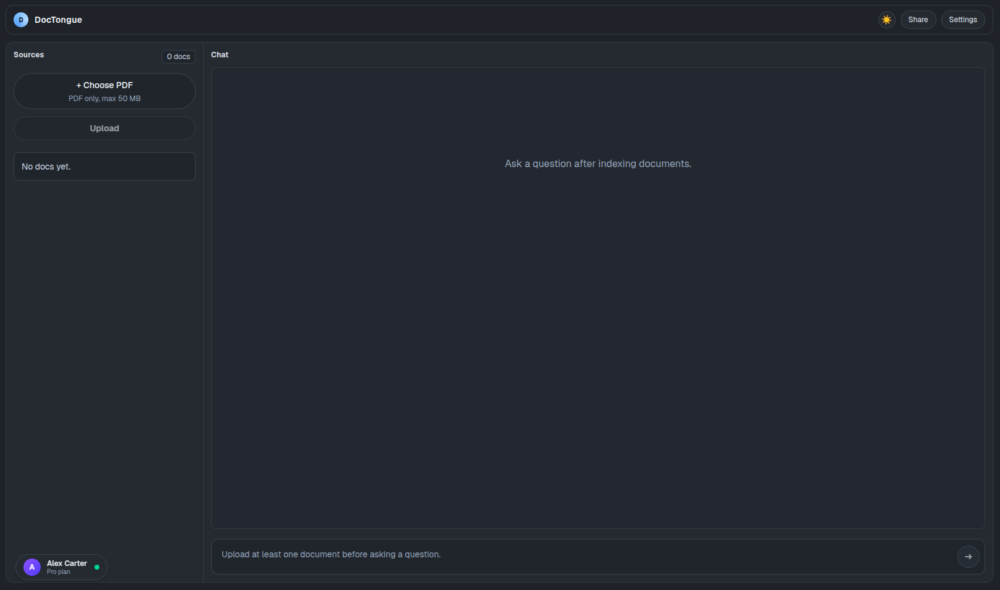
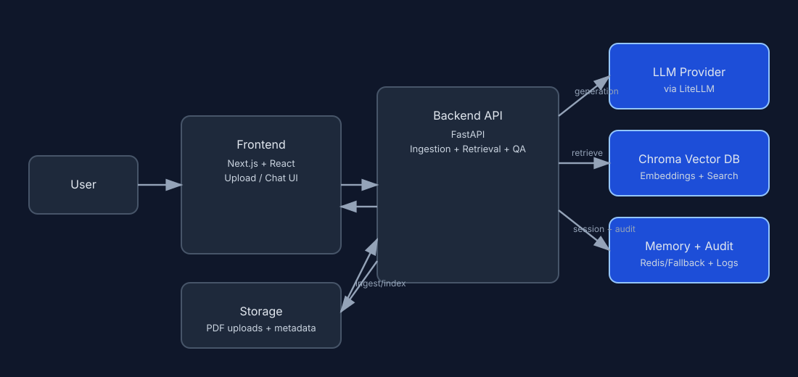

# DocTongue



## 1) Project Description

DocTongue is a full-stack Retrieval-Augmented Generation (RAG) application for document question answering.

- Users upload PDF files.
- The system indexes document chunks into a vector store.
- Users ask questions in chat.
- The assistant answers with grounded citations from uploaded documents.

## 2) Setup (Containerization + ENV)

### Prerequisites

- Docker Engine (with Docker Compose plugin).
- Ports `3000` and `8000` available on your machine.

### Create ENV file

Create [backend/.env](backend/.env) and add at least the following:

```env
LLM_PROVIDER=stub
EMBEDDING_PROVIDER=local
LLM_MODEL=gpt-4o-mini
EMBEDDING_MODEL=text-embedding-3-small
QUALITY_CONTROL_ENABLED=0
REDIS_URL=redis://localhost:6379/0
```

Notes:

- `stub` + `local` works without external API keys.
- To use real providers, set provider values and corresponding keys (example: `OPENAI_API_KEY`).

### Start containers

From the project root:

```bash
docker compose up --build
```

Run detached:

```bash
docker compose up --build -d
```

Check status:

```bash
docker compose ps
```

Check logs:

```bash
docker compose logs -f
```

Stop:

```bash
docker compose down
```

### How to access the app

- Frontend UI: http://localhost:3000
- Backend API docs (Swagger): http://localhost:8000/docs
- Backend health endpoint: http://localhost:8000/health

Usage flow:

1. Open the frontend URL.
2. Upload one or more PDF files from the left panel.
3. Wait for indexing to finish.
4. Ask questions in the chat panel.
5. Review returned citations with each answer.


## 3) Architecture

High-level components:

- `frontend/`: Next.js UI for upload, document list, and chat.
- `backend/`: FastAPI APIs for ingestion, retrieval, and answer generation.
- `backend/data/chroma/`: local vector persistence.
- `backend/data/uploads/`: uploaded PDFs.

Architecture diagram (SVG):



## 4) Moving to Production on Hyper-Scalers (AWS / GCP / Azure / Cloudflare)

Key considerations before production rollout:

- **Authentication and authorization**: Add `OIDC/OAuth2` login and role-based access control.
- **Identity and secrets**: Use managed identity/IAM roles and secret stores (Azure Key Vault / AWS Secrets Manager) instead of static secrets in files.
- **Storage hardening**: Move uploads and artifacts to object storage (Azure Blob / AWS S3) lifecycle policies, and backups.
- **Vector database strategy**: Use a managed vector store or run Chroma with persistent volumes, backups, and DR procedures.
- **Networking and security**: Use private networking, TLS.
- **Observability**: Centralize logs, traces, metrics, dashboards, and on-call alerts.
- **Scalability and reliability**: Add autoscaling for API/workers, queue-based ingestion for large files.
- **Compliance and governance**: Define data retention, residency, recovery and backup.


## 5) RAG/LLM Approach and Decisions

| Area | Choices considered | Final choice and why |
|---|---|---|
| LLM provider | Direct SDK integration per provider vs model-agnostic adapter. | **LiteLLM abstraction** for portability; provider/model can change through ENV with minimal code changes. |
| Embedding model | Local deterministic embedding vs hosted embedding APIs. | **Configurable embeddings**, currently `text-embedding-3-small`; local hash embedding remains available for no-key local development. |
| Vector database | In-memory index, self-hosted vector DB, or managed vector DB. | **Chroma (local persistent)** for simple setup and fast iteration in this project scope. |
| Orchestration framework | Full agent framework vs direct service orchestration in backend code. | **Direct orchestration in FastAPI services** for lower complexity and easier debugging in a small codebase. |
| Chunking strategy | Semantic chunking vs fixed-size chunking with overlap. | **Fixed-size + overlap** chosen for simplicity, predictable behavior, and straightforward tuning. |
| Retrieval strategy | Dense-only retrieval vs hybrid retrieval and reranking. | **Vector top-k + lightweight grounding filters** implemented now for a simple and stable baseline. |
| Prompt & context management | Stateless prompt only vs session-aware reformulation and memory. | **Grounded system prompt + sliding window memory** to keep answers citation-based while improving follow-up query resolution. |
| Guardrails | No input filter vs explicit pre-check policy layer. | **Input guardrails enabled** for prompt-injection patterns and explicit sexual content at the `/api/chat` boundary. |
| Quality control | No judge, heuristic-only, or LLM-as-judge with fallback. | **Optional `deepeval` judge** with deterministic lexical fallback for reliability when external judge execution fails. |
| Observability | Console-only logs vs structured logs + audit artifacts. | **Application logging + chat audit file** for runtime diagnostics and future auditing workflows. |

## 6) Technical Decisions Taken

Current simple decisions:

- Next.js + FastAPI split for clear frontend/backend boundaries and independent scaling.
- Chroma local persistence for quick local development and zero-extra infrastructure.
- LiteLLM abstraction to keep model providers swappable without coupling business logic to one SDK.
- Guardrails + optional quality control path to improve safety and answer reliability.

If more time is available:

- Async ingestion pipeline with queue/worker model.
- Better retrieval evaluation dataset and automated scoring.
- Hybrid retrieval (dense + lexical) and reranking.
- Production-grade observability and SLO definitions.

Engineering standards document:

- [ENGINEERING_STANDARDS.md](ENGINEERING_STANDARDS.md)

## 7) How Coding Agent (GitHub Copilot) Was Used

GitHub Copilot was used as a coding assistant for:

- scaffolding and refactoring support,
- faster iteration on UI and backend integration,
- generating baseline tests and improving developer throughput.

All generated output was reviewed and adjusted manually before acceptance.

## 8) What We'd Do Differently With More Time

- Implement user authentication / authoriztaion.
- OCR pipeline for scanned PDFs.
- Better citation UX (page-level and highlighted spans).
- Cloud-native deployment templates (Azure/AWS).

## 9) Screenshots and Example Video

Screenshot(s):

- Main dashboard: 

<video controls src="assets/simplescreenrecorder-2026-07-22_15.30.13.mp4"></video>

If embedded playback is unsupported, open: [Demo video](assets/simplescreenrecorder-2026-07-22_15.30.13.mp4)

## 10) Licence

No licence file is defined yet in this repository.

---

Project note: The rationale in this document reflects implementation-specific engineering choices made in this repository, reviewed and edited by the project author.
